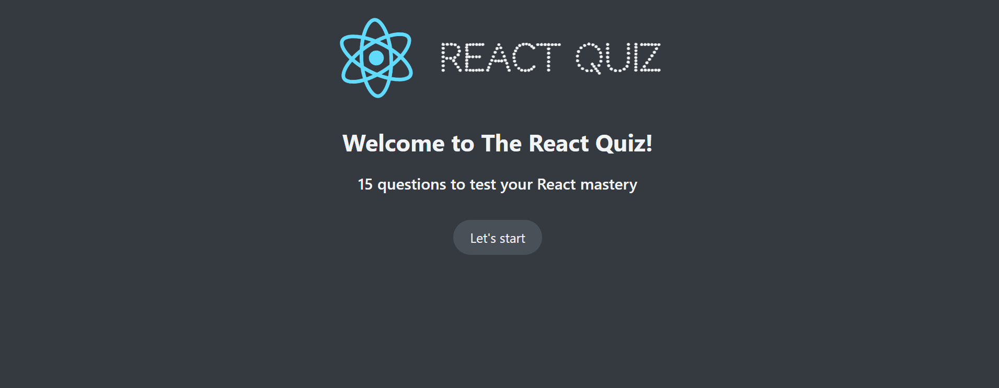
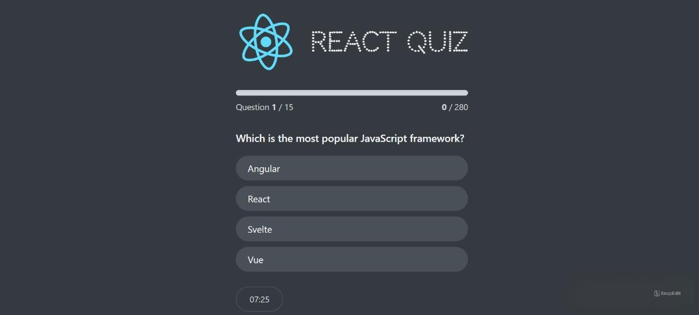
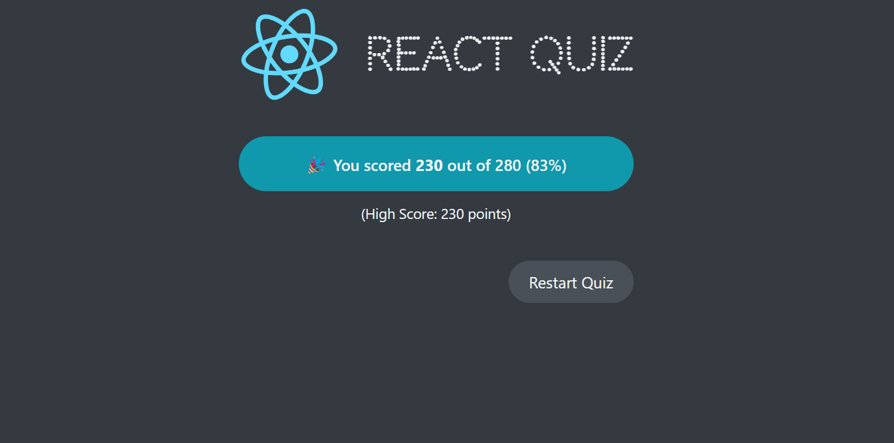

# React Quiz

React Quiz is a dynamic web application that allows users to test their knowledge through a series of interactive quizzes. The app offers a user-friendly interface, tracks user scores, and provides instant feedback on quiz answers.

## Table of Contents

- [Features](#features)
- [Tech Stack](#tech-stack)
- [Usage](#usage)
- [Screenshots](#screenshots)
- [Folder Structure](#folder-structure)
- [Contact](#contact)

## Features

- **Interactive Quizzes**: Multiple quizzes with various topics and question types.
- **Score Tracking**: Keeps track of user scores and displays results at the end of each quiz.
- **Instant Feedback**: Provides immediate feedback on whether the selected answer is correct or incorrect.
- **Responsive Design**: Optimized for both desktop and mobile devices.

## Tech Stack

- **Frontend**: ReactJS, CSS Modules
- **State Management**: React Hooks (useState, useEffect)
- **Routing**: React Router

## Usage

- **Select a Quiz**: Choose from a variety of quizzes on different topics.
- **Answer Questions**: Select the correct answer for each question.
- **View Results**: After completing the quiz, view your score and see which questions were answered correctly.

## Screenshots

Here are some screenshots of the React Quiz application:

*Home Screen*

*Question Screen*

*Results Screen*

## Folder Structure

- **components/**: Reusable UI components like QuizCard, ScoreBoard, etc.
- **pages/**: Different pages of the application, such as Home, Quiz, and Results.
- **styles/**: CSS Modules for styling.

## Contact

If you have any questions or feedback, feel free to reach out:

- **Email**: omarmohamed827@gmail.com
- **LinkedIn**: [Omar Mohamed](https://www.linkedin.com/in/omar-mohamed-611773292)
